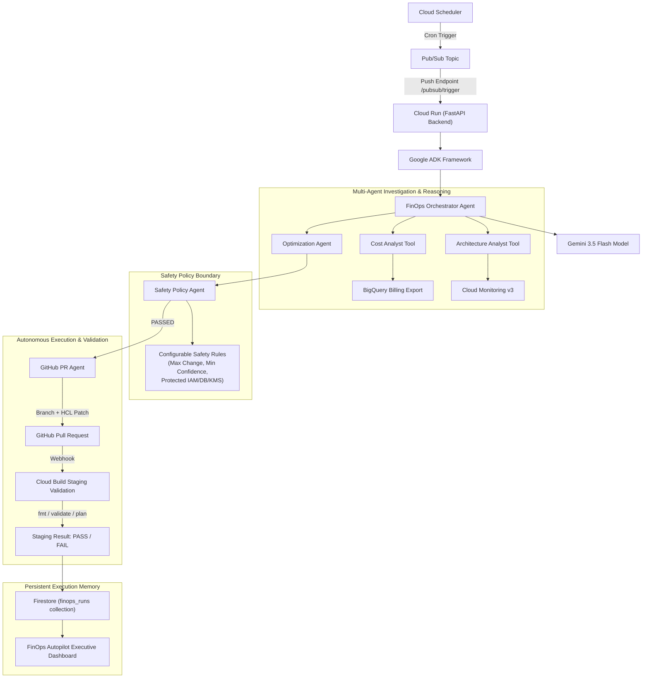

# FinOps Autopilot — Autonomous Cloud Cost & Architecture Optimization

[](https://github.com/google/adk)
[](https://deepmind.google/technologies/gemini/)
[](https://cloud.google.com/)
[](LICENSE)

**FinOps Autopilot** is an autonomous cloud cost and architecture optimization engineering agent built with **Google ADK (Agent Development Kit)** and **Gemini 3.5 Flash**, running on **Google Cloud**.

---

## 💥 Problem
Modern engineering teams waste **30% to 40% of their cloud budget** on over-provisioned infrastructure—such as 12-node GKE clusters running at <25% CPU and memory utilization, unattached storage volumes, or over-provisioned database instances. 

Existing FinOps tools stop at static recommendation dashboards and alerts, leaving engineers buried in manual metric analysis, ticket creation, Terraform HCL editing, and PR testing.

## 🚀 Solution
FinOps Autopilot automates the entire FinOps lifecycle through an **autonomous multi-agent engineering architecture**. 

Unlike standard dashboards or simple recommendation chatbots, FinOps Autopilot **takes real engineering action safely**:
1. **Investigates**: Queries BigQuery billing exports (`gcp_billing_export_v1`) and Cloud Monitoring v3 metrics.
2. **Reasons**: Identifies over-provisioned resources using Gemini 3.5 Flash reasoning.
3. **Optimizes**: Calculates safe right-sizing configurations (e.g. scaling GKE nodes from 12 to 5 while maintaining >50% safety headroom).
4. **Enforces Safety Policy Guardrails**: Evaluates financial impact caps ($1,000/mo limit), confidence scores (80%+ threshold), and protects core categories (IAM, KMS, production DBs).
5. **Acts via Infrastructure-as-Code**: Programmatically generates Terraform HCL patches, creates a git branch, and opens a GitHub Pull Request via PyGithub.
6. **Validates in Staging**: Triggers Cloud Build staging validation (`terraform fmt`, `terraform validate`, `terraform plan`, security checks, and unit tests).
7. **Remembers Execution State**: Persists run metadata in Google Cloud Firestore (`finops_runs`) for auditability and idempotency.
8. **Reports Financial Impact**: Displays real-time metrics ($432/month, $5,184/year savings) on a polished executive dashboard.

---

## 🤖 Why It Is Agentic

FinOps Autopilot implements an **8-Step Autonomous Engineering Loop**:

```
Trigger ➔ Analyze ➔ Reason ➔ Decide ➔ Act ➔ Validate ➔ Remember ➔ Report
```

- **Trigger**: Cloud Scheduler / Pub/Sub or manual dashboard invocation.
- **Analyze**: Automated multi-agent telemetry collection.
- **Reason**: Gemini 3.5 Flash architectural synthesis.
- **Decide**: Safety policy evaluation and risk assessment.
- **Act**: Autonomous Terraform HCL patch & GitHub PR creation.
- **Validate**: Automated Cloud Build staging pipeline execution.
- **Remember**: Stateful Firestore execution memory & idempotency checks.
- **Report**: Single-source-of-truth financial dashboard updates.

---

## 🏗️ System Architecture



---

## 🎯 Golden Demo Workflow

- **Resource**: GKE Cluster `prod-core-cluster` (`default-pool`)
- **Current Nodes**: `12` nodes (`e2-standard-8`)
- **CPU Utilization**: `21.4%`
- **Memory Utilization**: `28.7%`
- **Recommended Nodes**: `5` nodes (`e2-standard-8`)
- **Projected Monthly Savings**: `$432.00`
- **Projected Annual Savings**: `$5,184.00`
- **Confidence Score**: `94.0%`

---

## 🔍 System Reality & Execution Modes

| Feature / Tool | `DEMO_MODE=true` (Hackathon Demonstration) | `DEMO_MODE=false` (Live Production GCP) |
| :--- | :--- | :--- |
| **Cost Data** | Structured seeded billing dataset ([`demo/gke_metrics.json`](file:///Users/saispoorthyeturu/Finops-Autopilot/Finops-Autopilot-1/demo/gke_metrics.json)) | Live BigQuery Billing Export SQL query (`gcp_billing_export_v1`) |
| **Infrastructure Metrics** | Seeded 30-day GKE utilization (21.4% CPU, 28.7% Memory) | Live Google Cloud Monitoring v3 (`kubernetes.io/container/cpu/utilization`) |
| **Reasoning Engine** | Gemini 3.5 Flash (`google-genai` / `google.adk`) with labeled fallback | Live Gemini 3.5 Flash (`gemini-3.5-flash` / Vertex AI) |
| **Safety Engine** | Full Safety Agent policy evaluation (IAM/KMS/DB caps) | Full Safety Agent policy evaluation |
| **Terraform Patch** | Programmatically updates [`gke.tf`](file:///Users/saispoorthyeturu/Finops-Autopilot/Finops-Autopilot-1/infrastructure/terraform/gke.tf) (`node_count` 12 $\rightarrow$ 5) | Programmatically updates [`gke.tf`](file:///Users/saispoorthyeturu/Finops-Autopilot/Finops-Autopilot-1/infrastructure/terraform/gke.tf) |
| **GitHub Integration** | Labeled simulation mode `[SIMULATED — DEMO MODE]` (or PyGithub if `GITHUB_TOKEN` provided) | PyGithub creates Git branch, commits patch, opens Pull Request |
| **Staging Validation** | Staging execution pipeline + pytest (`[SIMULATED — DEMO MODE]`) | Google Cloud Build pipeline submission (`cloudbuild.yaml`) |
| **Execution Memory** | Persistent local JSON state ([`demo/execution_history.json`](file:///Users/saispoorthyeturu/Finops-Autopilot/Finops-Autopilot-1/demo/execution_history.json)) | Google Cloud Firestore (`finops_runs` collection) |

---

## 🛠️ Setup & Quickstart

1. **Clone & Virtual Environment**:
   ```bash
   git clone https://github.com/ESpoorthy/Finops-Autopilot.git
   cd Finops-Autopilot
   python3 -m venv .venv
   source .venv/bin/activate
   pip install -r requirements.txt
   ```

2. **Configure Environment Variables**:
   Copy `.env.example` to `.env`:
   ```bash
   cp .env.example .env
   ```

3. **Run Test Suite**:
   ```bash
   .venv/bin/pytest tests/ -v
   ```

4. **Launch Local Server**:
   ```bash
   .venv/bin/python -m uvicorn backend.main:app --port 8000
   ```
   Access the dashboard at [http://127.0.0.1:8000](http://127.0.0.1:8000).

---

## ☁️ Cloud Run Deployment

Deploy backend service to Google Cloud Run:
```bash
gcloud run deploy finops-autopilot \
  --source . \
  --platform managed \
  --region us-central1 \
  --allow-unauthenticated \
  --set-env-vars GEMINI_MODEL=gemini-3.5-flash,DEMO_MODE=true
```

---

## 🛡️ Security Model

FinOps Autopilot enforces **Autonomy Within Policy Boundaries**:
- Production Terraform deployment is **NEVER** performed automatically.
- All infrastructure modifications require passing safety policy guardrails, Cloud Build staging validation, and **mandatory human engineer review and merge**.

---

## 📋 Limitations & Future Scope
- Currently optimized for GKE node-pools and Kubernetes infrastructure right-sizing.
- Future roadmap includes Cloud Storage lifecycle policy automation and Cloud SQL auto-pausing.

---

## 📄 License
[MIT License](LICENSE) — FinOps Autopilot Team
