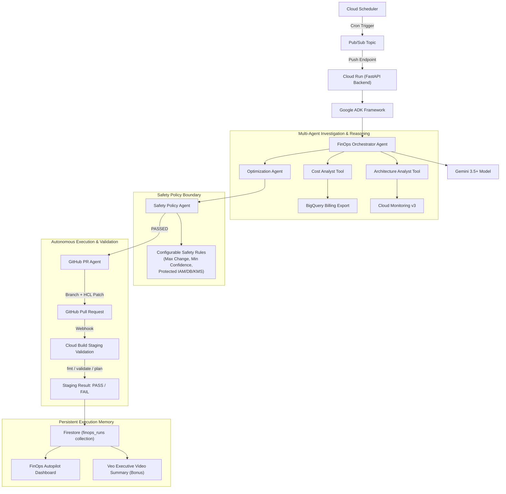

# FinOps Autopilot — Architecture & Dataflow

## Overview
FinOps Autopilot is an autonomous cloud cost & architecture optimization platform powered by **Google ADK** and **Gemini 3.5+**, deployed natively on **Google Cloud**.

## Core Architectural Principles

1. **Trigger to Report Autonomous Loop**:
   - Trigger -> Investigate -> Reason -> Decide -> Act -> Validate -> Record -> Report.
2. **Autonomy Within Policy Boundaries**:
   - Direct automated production terraform deployment is forbidden.
   - All infrastructure modifications are proposed as GitHub Pull Requests requiring staging validation (Cloud Build) and mandatory human merge.
3. **Dual-Mode Operational Support**:
   - `DEMO_MODE=true`: Deterministic seeded data for golden GKE right-sizing scenario ($432/mo savings, $5,184/yr, 12 -> 5 nodes).
   - `DEMO_MODE=false`: Live GCP APIs (BigQuery, Cloud Monitoring, Firestore, GitHub API).
4. **Persistent Execution Memory & Idempotency**:
   - Execution runs stored in Firestore (`finops_runs`).
   - Idempotency guard prevents duplicate PRs or repeated optimization of active resources.
