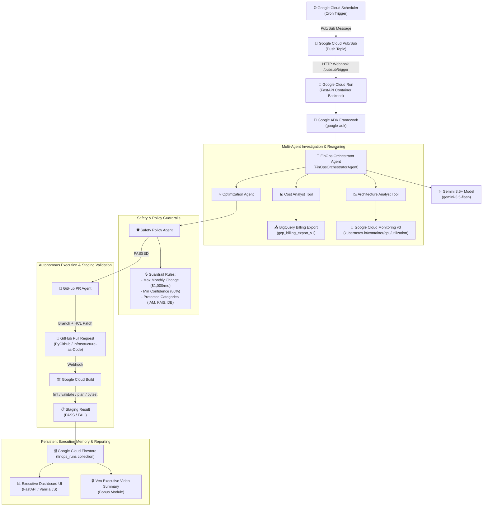

# FinOps Autopilot — Architecture & Technical Specifications

FinOps Autopilot is an autonomous cloud cost & architecture optimization platform built with **Google ADK (Agent Development Kit)** and **Gemini 3.5+**, deployed natively on **Google Cloud**.

---

## 🏗️ End-to-End System Architecture

---

## 🔍 Data Flow & Step Execution

| Step | Phase | Engine / Tool | Function |
| :--- | :--- | :--- | :--- |
| **1. Trigger** | Invocation | Cloud Scheduler $\rightarrow$ Pub/Sub | Scheduled cron or manual dashboard trigger POST `/api/run-orchestrator`. |
| **2. Analyze** | Investigation | `CostAnalyst` & `ArchitectureAnalyst` | Queries BigQuery billing export and Cloud Monitoring 30-day utilization. |
| **3. Reason** | Intelligence | Gemini 3.5+ (`gemini-3.5-flash`) | Analyzes utilization metrics, identifies over-provisioning (12 $\rightarrow$ 5 nodes), synthesizes reasoning. |
| **4. Decide** | Safety Check | `SafetyAgent` | Evaluates $1,000/mo cap, 80% confidence, and protects IAM/KMS/DB resources. |
| **5. Act** | IaC Automation | `GitHubAgent` | Updates `infrastructure/terraform/gke.tf`, creates Git branch, and opens PR. |
| **6. Validate** | CI/CD Staging | `ValidationAgent` / Cloud Build | Runs `terraform fmt`, `terraform validate`, `terraform plan`, security checks, and pytest. |
| **7. Remember** | Audit Memory | `MemoryAgent` / Firestore | Saves state machine records (`finops_runs`), providing full idempotency. |
| **8. Report** | Executive UI | Dashboard | Renders financial KPIs ($432/mo, $5,184/yr savings) and live run timeline. |

---

## ⚙️ Google Cloud Infrastructure Stack

- **Reasoning Engine**: Gemini 3.5 Flash (`gemini-3.5-flash`) via `google-genai` & Google ADK `google.adk`.
- **Application Server**: Google Cloud Run (Containerized FastAPI service with auto-scaling).
- **Billing Intelligence**: Google BigQuery (`gcp_billing_export_v1`).
- **Telemetry & Metrics**: Google Cloud Monitoring v3 (`kubernetes.io/container/cpu/utilization`).
- **State & Idempotency**: Google Cloud Firestore (`finops_runs` collection).
- **Staging Pipeline**: Google Cloud Build (`cloudbuild.yaml`).
- **Event Orchestration**: Google Cloud Pub/Sub & Google Cloud Scheduler.
